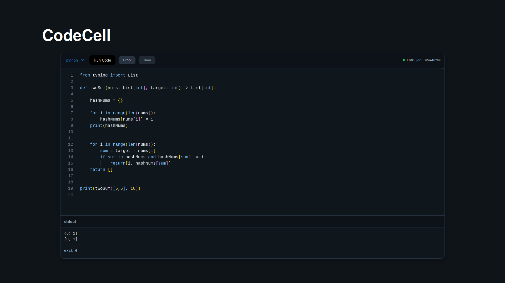

# CodeCell Live

Real‑time collaborative IDE that executes code inside **Firecracker microVMs** orchestrated by a **Go** backend. **Python‑only** runtime for now. Frontend: **React/TypeScript + Monaco**. Gateway: **tRPC/HTTP** with **WebSocket** streaming.


---

## Screenshot


> 

---

## Quick Start

Open **three terminals**: `sandbox`, `gateway`, `frontend`.

**1) Sandbox (Go + Firecracker)**

```bash
cd sandbox
go run main.go
# logs: Sandbox listening on :5000
```

**2) Gateway (tRPC/HTTP)**

```bash
cd gateway
npm install
npm run dev            # http://localhost:4000
```

**3) Frontend (Vite)**

```bash
cd frontend
npm install
npm run dev            # http://localhost:5173
```

### .env examples

**gateway/.env**

```
PORT=4000
SANDBOX_ADDR=127.0.0.1:5000
RUN_TIMEOUT_MS=5000
MAX_MEM_MB=256
MAX_VCPUS=1
```

**frontend/.env**

```
VITE_API_URL=http://localhost:4000
```

---

## How it works

* **Run**: Frontend calls `runCode` (tRPC). Gateway creates a job and POSTs to **sandbox** `http://localhost:5000/run`.
* **Execute**: Sandbox boots/attaches a Firecracker microVM, mounts a per‑session FS, runs Python, streams stdout/stderr.
* **Return**: Gateway relays output back to the UI; (upcoming) presence/selection via a separate WS server.

Sample payload:

```json
{
  "language": "py",
  "source": "print('hello')"
}
```

> Streaming: Gateway also exposes `ws://localhost:4000/stream/<jobId>` for live stdout/stderr relays.

---

## Minimal Structure

```
codecell-live/
├─ sandbox/        # Go Firecracker controller (POST /run on :5000)
├─ gateway/        # tRPC/HTTP API (Node/TS)
└─ frontend/       # React/TS + Monaco (Vite)
```

---
## Firecracker Notes

You need a kernel image and a rootfs with Python.

For fast cold starts, prewarm and snapshot a VM after Python deps are installed.

Ensure your user can access /dev/kvm. Running inside nested VMs may require enabling virtualization in BIOS and the host hypervisor.

## Roadmap

**Completed**

* [x] Python execution inside **Firecracker microVMs**
* [x] **Go** sandbox HTTP server (`POST /run` on :5000)
* [x] **tRPC/HTTP gateway** with job queue (port :4000)
* [x] Live stdout/stderr **WebSocket streaming** (`ws://localhost:4000/stream/<jobId>`)
* [x] **React/TypeScript + Monaco** UI (Vite)
* [x] End‑to‑end **Run** flow (Frontend → Gateway → Sandbox → Output)
* [x] `.env` configs + Quick Start scripts

**In progress / Next**

* [ ] **Collaboration**: live cursors & selections (separate WS server)
* [ ] Multi‑language runtimes (Node.js, Go, C/C++)
* [ ] Per‑session files + export
* [ ] AuthZ/quotas for hosted mode

---

## Prereqs

* Linux with **KVM**; **Firecracker** binary; kernel + rootfs with **Python 3.10+**
* **Node.js ≥ 18**, **Go ≥ 1.21**
